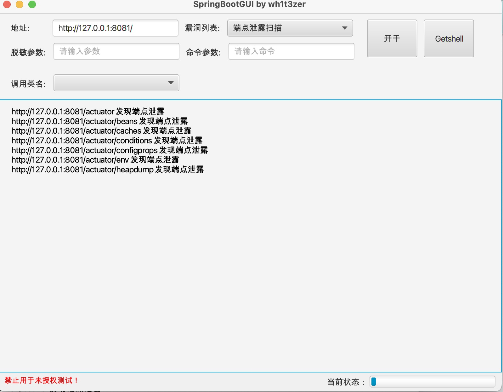

# SpringBootVul-GUI

一个半自动化springboot打点工具，内置目前springboot所有漏洞

## 声明


> **⚠️ 本项目所有内容仅作为安全研究和授权测试使用, 相关人员对因误用和滥用该项目造成的一切损害概不负责**

## 0x01简介

本着简单到极致的原则，开发了这么一款半自动化工具（PS：这个工具所包含了20个漏洞，开发不易，有任何问题可提issue）

尽管是一个为懒人量身打造的工具，但是还是有几点需要注意


注意！！以下几点请务必谨记

注意！！以下几点请务必谨记

注意！！以下几点请务必谨记

1、工具中出现的漏洞，需要先熟悉之后才能利用本工具。部分接口极其容易造成服务器的springboot服务异常，包括不限于报错、程序退出、无法执行代码，请小心使用！！

2、本工具仅限学习使用，请勿用于非法用途！！！！！！！！

3、工具仍在开发阶段，目前测试无异常，使用次数多难免会造成不可预见的问题，请提issue，确认后会修改BUG，感谢各位。


## 0x02使用教程

```bash
# git clone下载本项目
git clone https://github.com/wh1t3zer/SpringBootVul-GUI/tree/develop
可直接运行Springboot_vul.java

# 也可直接下载jar包
java -jar SpringBootVul_GUI.jar
```

确保采用的是jdk1.8版本

本系统采用的是javafx，高版本需自行加载javafx依赖

本项目中的heapdump转存会自动下载网站上的文件，并会放到jar包下的HFile文件夹


**文件结构**

```
├──SpringbootVul-GUI
  ├── META-INF/
  ├── resources/		# 存放资源文件、字典和exp的跨文件
  ├── HPFile/				# 存放下载的heapdump
  ├── src/					# 工程代码
  ├── image/				
  ├── libs/					# 所需依赖
```

## 0x03开发进度 TODO

* [x] 配置不正当导致的泄露
* [x] 脱敏密码明文(1)
* [x] 增加漏洞利用选择模块，可以选择单一或多个漏洞进行检测
* [x] 命令执行漏洞式支持交互式执行命令
* [x] Spring Gateway RCE
* [x] heapdump文件下载导致敏感信息泄露
* [x] druid数据连接池
* [x] 脱敏密码明文(2)
* [x] 脱敏密码明文(3)
* [x] eureka中xstream基于反序列化的RCE
* [x] spring.datasource.data 基于h2数据库的RCE
* [ ] 基于SpEL注入的RCE
* [ ] SpringCloud的SnakeYaml的RCE
* [ ] jolokia中logback基于JNDI注入的RCE
* [ ] jolokia中realm基于JNDI注入的RCE
* [ ] H2数据库设置query属性的RCE
* [ ] h2数据库的控制台基于JNDI注入的RCE
* [ ] mysql中jdbc基于反序列化的RCE
* [ ] logging.config的logback基于JNDI的RCE
* [ ] logging.config的groovyRCE
* [ ] spring.main.source的groovyRCE

## 0x04短期目标 Prepare

* [x] 一键打入内存马(目前只有Spring Cloud Gateway)
* [ ] 加入Bypass逻辑
* [ ] 加入深度扫描任务

## 0x05项目演示

### #1 密码脱敏

脱敏（1）


脱敏（2）

得到Authorization字段的数据，用base64解码即可，有时间再优化下能直接显示到文本框里


脱敏（3）


### #2 Spring Cloud Gateway 交互式命令


### #3Eureka 反序列化RCE（慎用）

直接点击getshell反弹，单纯poc测试的没写，python文件放同一目录下了，需要在vps启用2个端口，一个是你python服务器的端口，一个是反弹端口，写在python文件中，反弹端口默认是9000，注意这两个端口区别，输入框的端口是python端口

**注意！！！**该数据包发送后会驻留到目标Eureka，会不断请求，若造成服务器出错时，可能会导致无法访问网站的路由


### #4H2DatabaseSource RCE（慎用）

目前已经基本完成一键getshell，理论上只要在不关闭的情况下可以无限弹，因为目前的payload是从T5开始的，如果遇到网站被测试过时，那大概率会报错而导致对方服务宕机，因为这是不回显RCE，无法判断到底有没有被测试过。

监听端口默认是**8881**

输入框中填写你开启服务器的端口，目前为了能无限弹的机制，暂时只能设置在该项目的resources文件夹开启

```bash
python -m http.server 80
```


### #5 端点扫描

端点扫描经过延时降速处理，防止请求频繁，heapdump文件无法下载，不过偶尔还会发生，直接手动下载就可以了



### #6 一键上马


## 0x06参考项目

感谢以下项目或文章提供帮助和支持，具体漏洞原理可参考以下地址

1、https://github.com/LandGrey/SpringBootVulExploit

2、https://mp.weixin.qq.com/s/2wKB3jACAkIiIZ96tVb5fA

3、https://xz.aliyun.com/t/11331?time__1311=Cq0xR70QoiqDqGXYYIhxWucgYDkIHT1iT4D#toc-3


## Star History

[](https://star-history.com/#wh1t3zer/SpringBootVul-GUI&Date)

